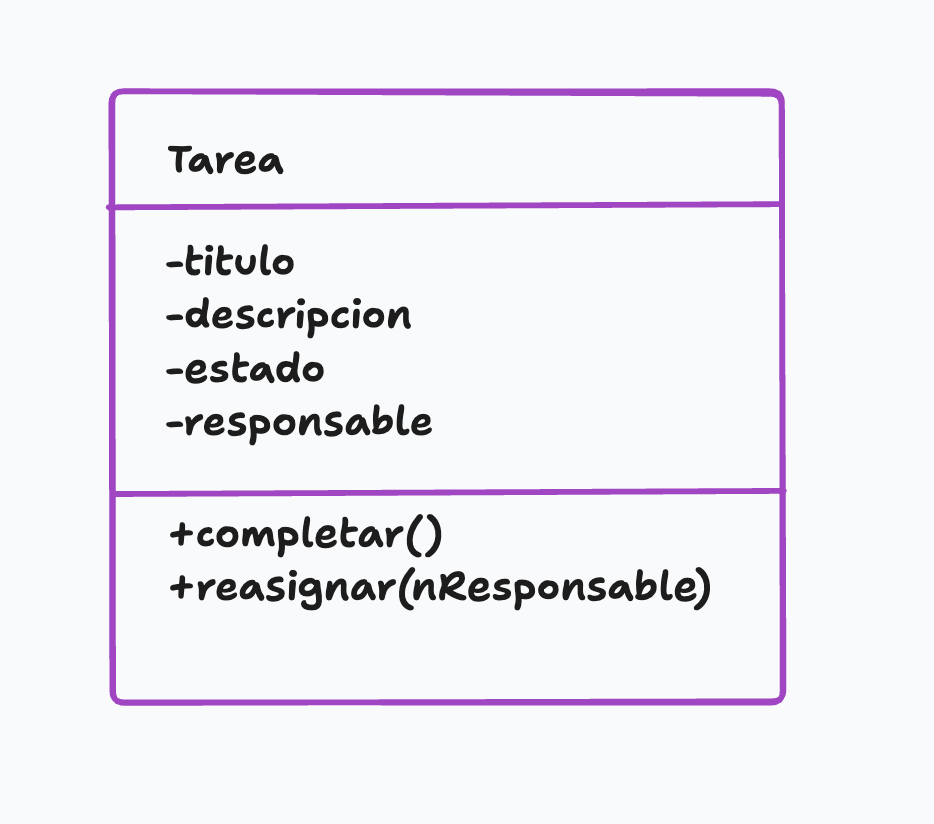
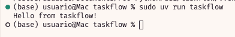
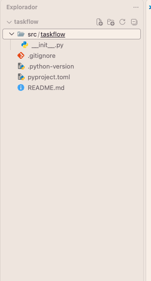

[Discord](https://discord.gg/XheWhsqpa)

# 📕 ¿Por qué necesitamos los objetos?

> **Tenemos que desarrollar una aplicación para gestionar proyectos en una empresa de software. ¿Cómo representamos usuarios, proyectos, tareas, equipos...?**

Al principio, podríamos resolverlo con variables y funciones:

```py
tarea_1_titulo = "Diseñar login"
tarea_1_estado = "pendiente"
tarea_1_responsable = "Ana"

tarea_2_titulo = "Crear API"
tarea_2_estado = "en progreso"
tarea_2_responsable = "Luis"
```

Y funciones:

```py
def completar_tarea(...):
    ...

def cambiar_responsable(...):
    ...

def mostrar_tarea(...):
    ...
```

>Rápidamente aparecen las preguntas:
> - ¿A qué proyecto pertenece la tarea?
> 
> - ¿Quién es responsable?
> 
> - ¿Qué ocurre si tenemos 200 tareas?
> 
> - ¿Cómo evitamos mezclar los datos?
> 
> - ¿Dónde colocamos las operaciones relacionadas con una tarea?

# 🍗 Pensar en objetos. Programación orientada a objetos

> La POO organiza el software alrededor de objetos que representan elementos del problema y combinan información y comportamiento.

Un **objeto** representa una entidad que tiene:

- Información sobre sí mismo
- Comportamiento
- Una identidad propia

Podríamos pensar inicialmente en:

```py
Proyecto
Tarea
Usuario
```

Una `Tarea` podría tener:

```py
Título
Descripción
Estado
Responsable
```

Y podría realizar determinadas acciones:

```py
Completar
Reasignar
Cambiar de estado
```

Esto nos lleva a una serie de **conceptos fundamentales**.

## Estado

El **estado** de un objeto es la información que describe cómo se encuentra ese objeto en un momento determinado.

El estado está compuesto por los datos o características que tiene un objeto en un momento determinado. En programación, el estado se almacena en las variables o atributos del objeto. El estado puede cambiar a lo largo del tiempo.

Por ejemplo, una tarea podría tener:

```py
Título: Diseñar pantalla de login
Estado: pendiente
Responsable: Ana
```

Ese conjunto de valores forma parte del estado de la tarea.

Si la tarea se completa:

```py
Título: Diseñar pantalla de login
Estado: completada
Responsable: Ana
```

El objeto sigue siendo la misma tarea, pero su estado ha cambiado.

Podemos representar el cambio:

ESTADO INICIAL

estado = "pendiente"

        │
        │ completar()
        ▼

NUEVO ESTADO

estado = "completada"

## Clase ≠ Estado

Una clase es el **molde, plantilla o plano arquitectónico** a partir del cual se crean los objetos. No es un objeto real, sino la definición de cómo será ese objeto. Define qué datos tendrá y qué acciones podrá realizar.

Una clase define qué información puede tener un determinado tipo de objeto.

Pero cada instancia tendrá sus propios valores.

Por ejemplo:

```py
Tarea 
│ 
├── tarea1 
│ ├── título: "Diseñar login" 
│ └── estado: "pendiente" 
├── tarea2 
│   ├── título: "Crear API" 
│   └── estado: "en progreso" 
└── tarea3 
    ├── título: "Escribir documentación" 
    └── estado: "completada"
```

Las tres pertenecen a la clase `Tarea`, pero sus estados son diferentes.

En Python:

```py
tarea1 = Tarea()
tarea2 = Tarea()
tarea3 = Tarea()
```

Cada objeto tiene su propio estado.

## Objeto

Un objeto es una entidad concreta creada a partir de una clase.


## Instancia


En Python utilizamos habitualmente el término instancia para referirnos a un objeto concreto creado a partir de una clase.

Por ejemplo:

`tarea1 = Tarea()`

`tarea2 = Tarea()`

Podemos representarlo:

                    CLASE
                     Tarea
                       │
              ┌────────┴────────┐
              ▼                 ▼
           tarea1             tarea2
          instancia          instancia

Las dos instancias pertenecen a la misma clase, pero son objetos diferentes.

```py
tarea1 = Tarea()
tarea2 = Tarea()

print(tarea1 is tarea2)
```

Resultado:

`False`


## Comportamiento

El **comportamiento** representa las acciones que un objeto puede realizar.

Una tarea podría:

```py
completar()
reasignar()
cambiar_estado()
```

Por ejemplo:

`tarea.completar()`

puede provocar:

```py
estado = "pendiente"
        │
        │ completar()
        ▼
estado = "completada"
```

El comportamiento se implementará mediante **métodos**.

Podemos representarlo así:

{width=400px}

## Responsabilidad

> **¿De qué debería encargarse cada objeto?**

Una **responsabilidad** es aquello que un objeto debe conocer o hacer dentro del sistema.

Por ejemplo, podemos decir que una `Tarea` es responsable de:

- conocer su título;
- conocer su estado;
- conocer su responsable;
- cambiar su estado;
- cambiar su responsable.

Pero probablemente no debería ser responsable de:

- enviar correos electrónicos;
- generar documentos PDF;
- conectarse directamente a una base de datos;
- enviar mensajes a Telegram.

> Una pregunta importante cuando diseñes una clase es:
> **¿Tiene sentido que este objeto sea responsable de hacer esto?**

# 🧬 Los cuatro pilares fundamentales de la POO

- **Abstracción**: Aislar los detalles complejos de un objeto y mostrar sólo las características esenciales. Ejemplo: Al manejar un auto, usas el volante y los pedales sin necesidad de entender cómo funciona el motor por dentro.
- **Encapsulamiento**: Agrupar los datos (atributos) y las acciones (métodos) dentro de una misma clase, protegiendo el acceso externo no autorizado. Ejemplo: El saldo de una cuenta bancaria está oculto y sólo se puede modificar de forma segura mediente métodos controlados como `depositar()` o `retirar()`.
- **Herencia**: Permitir que una nueva clase (hija) obtenga los atributos y métodos de otra clase existente (padre) para reutilizar código. Ejemplo: Una clase `CocheElectrico` puede heredar de la clase base `Coche` y añadir funciones propias como `cargar_bateria()`.
- **Polimorfismo**: La capacidad de que un mismo método o función se comporte de manera distinta según el objeto que lo ejecute. Ejemplo: El método `acelerar()` funciona de forma diferente si lo ejecuta un `Coche`, una `Bicicleta` o un `Tren`.

# ✍ El modelo mental fundamental

A partir de ahora podemos analizar cualquier problema siguiendo esta secuencia:

**PROBLEMA REAL -> ¿Qué cosas existen? -> OBJETOS -> ¿Qué sabe cada objeto? -> ESTADO -> ¿Qué puede hacer? -> COMPORTAMIENTO -> ¿De qué debe encargarse? -> RESPONSABILIDADES -> DISEÑO -> UML**

# 🐍 Primer contacto con Python

## IDE

Vamos a utilizar como ide **VSCode + extensión oficial de Python de Microsoft**

## Creación de un entorno virtual

> Necesitamos la creación de un entorno virtual. Vamos a empezar a trabajar como se trabajaría en un proyecto profesional, por lo tanto, no vamos a instalar todas las dependencias de nuestros proyectos en global en el equipo sino locales a cada proyecto.


Si lo instalásemos de forma global, como vemos a continuación, podría provocar conflictos de paquetes y versiones.

```py
PYTHON DEL ORDENADOR
        │
        ├── Proyecto A
        │      └── dependencias
        │
        ├── Proyecto B
        │      └── dependencias
        │
        └── Proyecto C
               └── dependencias
```

Con un entorno virtual:

```py
PYTHON DEL ORDENADOR
        │
        ├── entorno proyecto A
        │      ├── Python
        │      └── dependencias
        │
        ├── entorno proyecto B
        │      ├── Python
        │      └── dependencias
        │
        └── entorno proyecto C
               ├── Python
               └── dependencias
```

Cada proyecto ve su versión de Python y las dependencias que necesita con sus versiones correspondientes.

## Gestión de nuestros proyectos

Para la gestión del entorno virtual de cada proyecto tenemos dos opciones:

```py
              PROYECTO PYTHON
                    │
          ┌─────────┴─────────┐
          │                   │
    ENTORNO AISLADO       GESTIÓN DEL PROYECTO
          │                   │
        venv                  uv
          │                   │
    "Dónde se instalan       "Cómo gestiono
     las dependencias"        el proyecto"

```

Con **uv** también podemos crear y gestionar nuestros entornos virtuales, por lo que `uv` puede sustituir el uso directo de `venv` en el día a día

## ¿Qué es `venv`?

`venv` es una herramienta que viene incluída con Python  y sirve fundamentalmente para crear un **entorno virtual aislado**.

```bash
python -m venv .venv
```

Esto crea:

```txt
mi-proyecto/
└── .venv/
```

Normalmente tenemos que activarlo. 
En Mac:

```bash
source .venv/bin/activate
```

En Windows:
```powershell
.venv\Scripts\activate
```

Después podríamos instalar los paquetes que necesitásemos de este modo (ejemplo):


```bash
pip install pytest
```

Dentro de `.venv` tendremos un entorno independiente donde podemos instalar paquetes.

La razón de utilizarlo es evitar situaciones como:

```txt
PROYECTO A
    └── necesita requests 2.x

PROYECTO B
    └── necesita requests 3.x
```

Sin entornos virtuales, ambos proyectos podrían entrar en conflicto. 

Con entornos virtuales:

```txt
PROYECTO A
└── .venv/
    └── requests 2.x

PROYECTO B
└── .venv/
    └── requests 3.x
```

>Cada proyecto tiene su propio **entorno**

## ¿Qué es `uv`?

>En proyectos profesionales vamos a utilizar `uv` para gestionar nuestros proyectos en Python. `uv` puede crear y administrar el entorno virtual, además de gestionar las dependencias.

Por ejemplo:

```bash
uv init
```

y 

```bash
uv add pytest
```

y 

```bash
uv run main.py
```

También podríamos hacer:
```bash
uv venv
```

y esto crearía un entorno virtual `.venv`

Conceptualmente:

```txt
python -m venv .venv
        │
        ▼
   crea entorno


uv venv
        │
        ▼
   crea entorno
```

>Los dos crean un entorno virtual. La diferencia es quién lo gestiona.

>**En este módulo utilizaremos `uv` para gestionar los proyectos Python**

## Flujo que vamos a seguir

### Instalaciones

En primer lugar, debemos instalar Python:

[Python](https://www.python.org/downloads/)

También debemos tener instalado `uv`, para ello:

**En Mac**

```bash
sudo curl -LsSf https://astral.sh/uv/install.sh | sudo sh
```

**En Windows, en la consola de Powershell**

```PowerShell
powershell -ExecutionPolicy ByPass -c "irm https://astral.sh/uv/install.ps1 | iex"
```

Alternativa con **Winget**:

```Powershell
winget install --id astral.uv
```

En cualquier sistema operativo, si tenemos `pip` instalado podemos hacer:

```bash
pip install uv
```
### Creación de un proyecto

Por ejemplo, para `Taskflow`, crearíamos:

```bash
mkdir taskflow
cd taskflow

uv init
```

```bash
uv run taskflow
```




Esto crea la siguiente estructura:



>**`uv` puede crear y gestionar entornos virtuales y proporciona además herramientas para gestionar el proyecto, sus dependencias y su ejecución. `venv` es la herramienta estándar incluida con Python para crear entornos virtuales.**


>Vamos a hacer una modificación importante. Por defecto, `uv`, nos crea cierta lógica en el fichero `__init__.py` que establece al crear el proyecto. Vamos a hacer algunos cambios iniciales:

- Crearemos un fichero `main.py` y trasladaremos a éste fichero el siguiente código:

`main.py`

```py
def main() -> None:
    print("Hello from taskflow!")
```

El fichero `__init__.py` debe quedar **vacío**.

- Modificamos el fichero `pyproject.toml` indicándole el nuevo punto de entrada de mi aplicación:

```toml
[project.scripts]
taskflow = "taskflow:main.main"
```

(Antes teníamos `taskflow:main` en esa sección.)

Para ejecutar mi proyecto seguiría haciendo `uv run taskflow` y debe funcionar mostrando el mensaje `Hello from taskflow!` en pantalla.


## Repositorios: Git

### ¿Qué problema resuelve Git?

```txt
taskflow_final.py
taskflow_final_v2.py
taskflow_final_v3.py
taskflow_final_definitivo.py
taskflow_final_definitivo_ahora_si.py
```

> - ¿Cómo sabemos qué hemos cambiado?
>
> - ¿Podemos volver atrás?
>
> - ¿Quién hizo el cambio?
>
> - ¿Qué ocurre si trabajamos dos personas?
>

> **Git es un sistema de control de versiones. Permite registrar la evolución de un proyecto y recuperar versiones anteriores**

En este módulo vamos a utilizar:

```txt
Git
↓
Sistema de control de versiones

GitHub
↓
Servicio donde podemos alojar
repositorios Git y colaborar
```

### Instalaciones necesarias

- Necesitamos instalar **Git**

[Git](https://git-scm.com/)

- Necesitamos tener una cuenta en **Github** para almacenar nuestros repositorios

[Github](https://github.com/)

### Primeros pasos

- Creamos un repositorio en Github
  
- Tenemos que inicializar Git en la carpeta local de nuestro proyecto

```bash
git init
```

- Cambiamos el nombre de nuestra rama principal para asegurarnos que es `main`

```bash
git branch -M main
```

Esto crea un directorio `.git`

- Conectamos la carpeta local con el repositorio remoto de GitHub

```bash
git remote add origin [URL-HTTPS-del-repositorio]
```

- Preparamos y confirmamos nuestros archivos

```bash
git add .
git commit -m "Primer commit"
```

- Subimos los cambios a GitHub

```bash
git push -u origin main
```

# 🐉 Clases en Python

Una clase básica:

```py
class Tarea:
    pass

tarea1 = Tarea()
tarea2 = Tarea()
```


```py
print(type(tarea1))
```

> Son objetos diferentes tarea1 != tarea2


# 💉 Atributos

Los atributos almacenan información asociada a un objeto.

Podemos hacer:

```py
class Tarea:
    pass

tarea = Tarea()

tarea.titulo = "Diseñar login"
tarea.estado = "pendiente"
tarea.responsable = "Ana"

print(tarea.titulo)

tarea.estado = "completada"
print(tarea.estado)
```

# 🐹 Constructor, ¿por qué lo necesitamos?

Aunque la solución anterior funciona, tiene un problema.

Podemos crear:

```py
tarea1 = Tarea()

tarea1.titulo = "Diseñar login"
```

y olvidarnos de `tarea1.estado` y `tarea1.responsable`. Esto provoca que el objeto no esté completo.

Queremos que `Tarea` se cree correctamente desde el principio. Para ello utilizamos `__init__`.

## El método `__init__`

Podemos definir:

```py
class Tarea:
    def __init__(self, titulo, esponsable):
        self.titulo = titulo
        self.responsable = responsable
        self.estado = "pendiente"
```

Ahora:

```py
tarea1 = Tarea("Diseñar login", "Ana")
```

>`__init__` se ejecuta cuando creamos una instancia.

por ejemplo al hacer:

```py
tarea = Tarea("Diseñar login", "Ana")
```

>En este momento, Python crea el objeto y ejecuta su método `__init__` para inicializarlo.

# 🏯 ¿Qué es `self`?

`self` es uno de los conceptos fundamentales de la POO en Python. Representa la instancia del objeto que se está creando o utilizando.

Cuando escribimos:

```py
class Tarea:
    def __init__(self, titulo):
        self.titulo = titulo
```

>`self` representa la **instancia concreta sobre la que estamos trabajando**

Si hacemos:

```py
tarea1 = Tarea("Diseñar login")
tarea2 = Tarea("Crear API")
```

el `self` dentro de `__init__` se refiere a `tarea1` en la primera llamada y a `tarea2` en la segunda.

>Por esto, `self.titulo` significa el atributo `titulo` de la instancia concreta que estamos creando o manipulando.

# 🐈 Parámetro frente a atributo

Observa este código:

```py
class Tarea:
    def __init__(self, titulo):
        self.titulo = titulo
```

Aquí aparecen dos elementos llamados `titulo`:

1. **Parámetro**: `titulo` es un parámetro del método `__init__`. 
2. **Atributo**: `self.titulo` es un atributo del objeto. Es una variable que pertenece a la instancia concreta y almacena información sobre ella.

# 🐦 Métodos

Un método es una función definida dentro de una clase que representa un comportamiento del objeto. Los métodos pueden acceder y modificar los atributos del objeto.

```py
class Tarea:
    def __init__(self, titulo, responsable):
        self.titulo = titulo
        self.responsable = responsable
        self.estado = "pendiente"

    def completar(self):
        self.estado = "completada"

```
Uso:

```py
tarea1 = Tarea("Diseñar login", "Ana")
print(tarea1.estado)  # pendiente
tarea1.completar()
print(tarea1.estado)  # completada
```

El método `completar` cambia el estado de la tarea a "completada".

## Métodos con parámetros

Los métodos también pueden recibir información:

```py
class Tarea:
    def __init__(self, titulo, responsable):
        self.titulo = titulo
        self.responsable = responsable
        self.estado = "pendiente"
    
    def reasignar(self, nuevo_responsable):
        self.responsable = nuevo_responsable
```

Podemos utilizarlo:

```py
tarea1 = Tarea("Diseñar login", "Ana")
tarea1.reasignar("Luis")
print(tarea1.responsable)  # Luis
```

>En este caso, `nuevo_responsable` es un **parámetro** del método `reasignar`, y `self.responsable` es el **atributo** de la instancia que estamos modificando.

## `self` y los métodos de instancia

Observa:

```py
class Tarea:
    def __init__(self, titulo, responsable):
        self.titulo = titulo
        self.responsable = responsable
        self.estado = "pendiente"
    
    def mostrar(self):
        print(f"Título: {self.titulo}, Estado: {self.estado}, Responsable: {self.responsable}")
```

Cuando hacemos `tarea.mostrar()`, Python pasa automáticamente la instancia `tarea` como el primer argumento `self` al método `mostrar`. Esto permite que el método acceda a los atributos de esa instancia específica.

# 🎛 Una clase completa

```py
class Tarea:
    def __init__(self, titulo, responsable):
        self.titulo = titulo
        self.responsable = responsable
        self.estado = "pendiente"

    def completar(self):
        self.estado = "completada"

    def reasignar(self, nuevo_responsable):
        self.responsable = nuevo_responsable

    def mostrar(self):
        print(f"Título: {self.titulo}, Estado: {self.estado}, Responsable: {self.responsable}")
```

Podemos crear una instancia:

```py
tarea = Tarea("Diseñar login", "Ana")
tarea.mostrar()  # Título: Diseñar login, Estado: pendiente, Responsable: Ana
tarea.completar()
tarea.mostrar()  # Título: Diseñar login, Estado: completada, Responsable: Ana
tarea.reasignar("Luis")
tarea.mostrar()  # Título: Diseñar login, Estado: completada, Responsable: Luis
```

También podemos crear varias instancias:

```py
tarea1 = Tarea("Diseñar login", "Ana")
tarea2 = Tarea("Crear API", "Luis")
tarea3 = Tarea("Escribir documentación", "Marta")

tarea1.completar()
print(tarea1.estado)  # completada
print(tarea2.estado)  # pendiente
print(tarea3.estado)  # pendiente
```

# 📌 Referencias a objetos

En Python, las variables que contienen objetos no almacenan el objeto en sí, sino una **referencia** al objeto en memoria. Esto significa que si asignamos un objeto a otra variable, ambas variables apuntarán al mismo objeto.

> Esto será especialmente importante cuando trabajemos con:
> - listas de objetos
> - diccionarios de objetos
> - composición de objetos (objetos que contienen otros objetos)
> ...


Por ahora, nos basta con comprender que una variable puede hacer referencia a un objeto.

# 📊 UML: representar el diseño

**UML (Unified Modeling Language)** es un lenguaje gráfico utilizado para modelar sistemas de software. Permite representar clases, objetos, relaciones y comportamientos de manera visual.

En esta unidad utilizaremos **diagramas de clases UML** para representar nuestras clases y sus relaciones.

Una clase puede representarse así:

```{.plantuml}
@startuml

class Tarea {
    - titulo: str
    - descripcion: str
    - completada: bool
    - prioridad: int

    + completar(): void
    + reabrir(): void
    + cambiar_prioridad(prioridad: int): void
    + esta_completada(): bool
}

@enduml
```
## UML y Python

Podemos pasar del diseño:

```{.plantuml}
@startuml

class Tarea {
    - titulo: str
    - descripcion: str
    - completada: bool
    - prioridad: int

    + completar(): void
    + reabrir(): void
    + cambiar_prioridad(prioridad: int): void
    + esta_completada(): bool
}

@enduml
```
a Python:

```py
class Tarea:
    def __init__(self, titulo, responsable):
        self.titulo = titulo
        self.responsable = responsable
        self.estado = "pendiente"
    
    def completar(self):
        self.estado = "completada"

    def reasignar(self, nuevo_responsable):
        self.responsable = nuevo_responsable
```

>El objetivo de UML no es obligarnos a dibujar diagramas antes de cada clase sino ayudarnos a pensar en el diseño antes de escribir código. Nos permite **visualizar la estructura y relaciones** de nuestro sistema.

## Visibilidad UML y Python

En UML podemos encontrar:

`+` público: accesible desde cualquier lugar (en algunas representaciones se puede mostrar con un círculo verde)

`-` privado: accesible solo dentro de la clase (en algunas representaciones se puede mostrar con un símbolo rojo)

`#` protegido: accesible dentro de la clase y sus subclases (en algunas representaciones se puede mostrar con un símbolo amarillo)

Por ejemplo: 

```{.plantuml}
@startuml

class Tarea {
    + titulo: str
    - estado: str
    # responsable: str

    + completar(): void
}

@enduml
```

>Al trasladar esto a Python, debemos tener en cuenta que Python no tiene un sistema de visibilidad estricta como otros lenguajes. Sin embargo, podemos seguir ciertas convenciones:
>- **Atributos y métodos públicos**: se definen normalmente, sin prefijo especial.
>- **Atributos y métodos protegidos**: se definen con un prefijo de guion bajo `_`, por ejemplo: `_estado`. Esto indica que son internos y no deberían ser accedidos desde fuera de la clase.
>- **Atributos y métodos privados**: se definen con un prefijo de doble guion bajo `__`, por ejemplo: `__responsable`. Esto activa el *name mangling* de Python, dificultando su acceso desde fuera de la clase, pero no lo hace imposible.

### Name Mangling


```py
class Tarea:

    def __init__(self, titulo):
        self.titulo = titulo
        self._estado = "pendiente"
        self.__codigo_interno = 12345
```

Tenemos:

```txt
Tarea
│
├── titulo
│     └── público
│
├── _estado
│     └── interno por convención
│
└── __codigo_interno
      └── name mangling
```

Desde fuera de la clase:

```py
tarea = Tarea("Diseñar login")

print(tarea.titulo)
print(tarea._estado)
```

Los dos funcionan, pero `_estado` es interno por convención y no debería ser accedido directamente.

Sin embargo:

```py
print(tarea.__codigo_interno)
```

No funciona, porque Python ha cambiado el nombre del atributo internamente a `_Tarea__codigo_interno`. Esto es lo que se llama *name mangling*.

#### Cuándo debo utilizar `__`

>**No debemos utilizar `__`simplemente porque queremos proteger un atributo.** El uso de `__` debería reservarse para casos donde realmente necesitamos que el nombre del atributo sea modificado por Python para evitar colisiones de nombres en clases heredadas.

```py
class Cuenta:

    def __init__(self):
        self.__saldo_interno = 0

    def ingresar(self, cantidad):
        self.__saldo_interno += cantidad

    def consultar_saldo(self):
        return self.__saldo_interno
```

El código externo trabaja mediante métodos:

```py
cuenta = Cuenta()

cuenta.ingresar(100)

print(cuenta.consultar_saldo())
```

En lugar de manipular directamente:

```py
cuenta.__saldo_interno = -500
```

Pero incluso aquí hay que entender que **name mangling no proporciona seguridad real**.

#### ¿Qué ocurre con los métodos?

**Exactamente lo mismo**.

```py
class Tarea:

    def __validar_estado(self):
        print("Validando estado")

    def completar(self):
        self.__validar_estado()
        print("Tarea completada")
```

El método `__validar_estado` sufre *name mangling* y pasa internamente a `_Tarea__validar_estado`.

>Los métodos `__init__, __str__`..., no están sufriendo *name mangling* porque son **métodos especiales de Python**.

